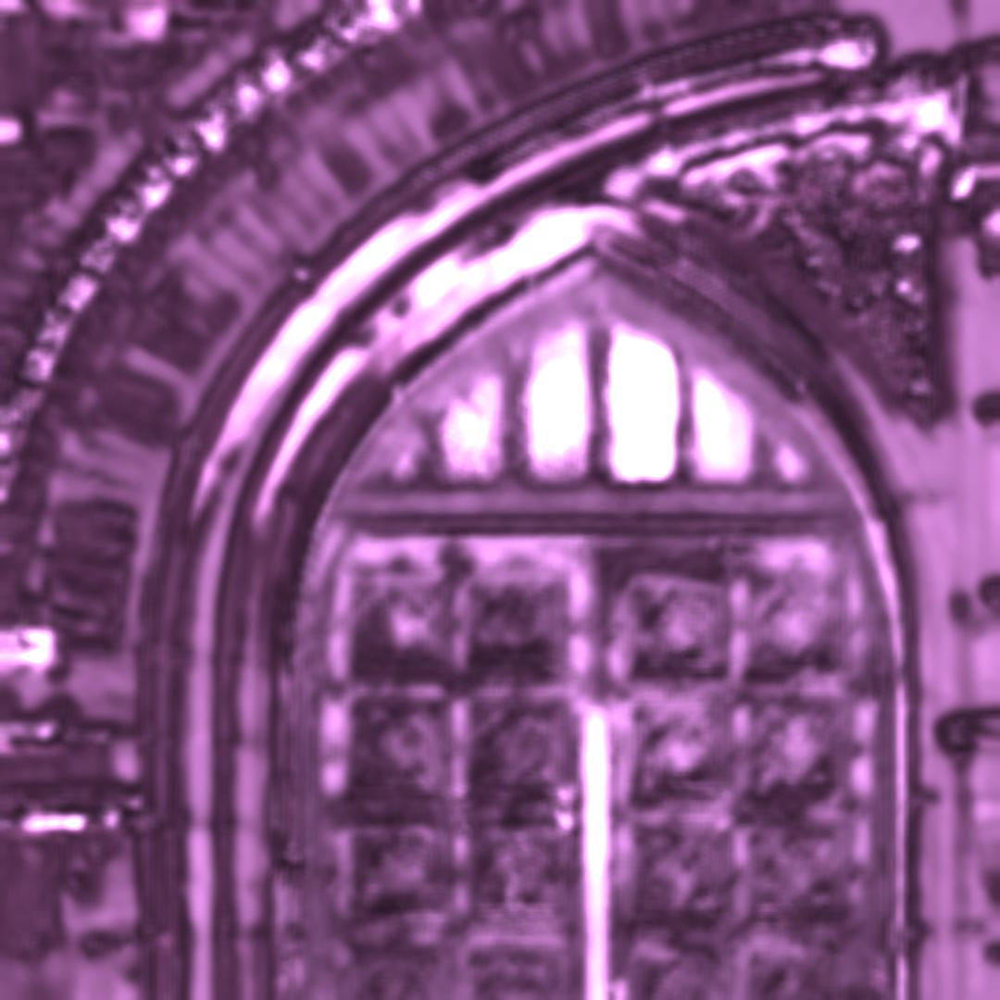
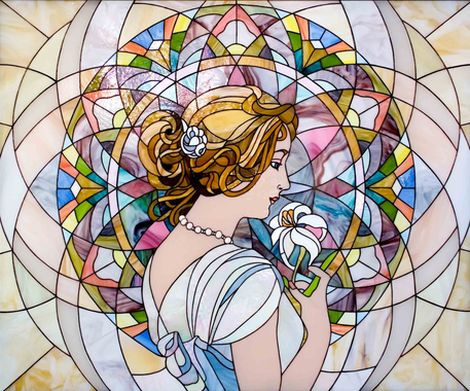

# pytorch_fast_style_transfer
Pytorch implementent of the fast style transfer paper "Perceptual Losses for Real-Time Style 
Transfer and Super-Resolution". arxiv link [1603.08155](https://arxiv.org/abs/1603.08155).

Contents:
+ [Contribution](#contribution)
+ [Intuition](#intuition)
+ [Results](#results)
+ [References](#references)

### Contribution
+ pytorch implement 
+ comparision experiments for different feature models
+ comparision experiments for different representation layer of the feature model

### Intuition
+ paper reimplement for better style transfer understanding.
+ What's the influence of the transformer net on the style transfer result?
+ Does the representation important (the vgg high dimension feature map) on the transformer model? 
What's the role of the feature model played on the transformer model?
+ How to set the layer set `J`. One certain layer is hard to choose for the perceptual loss, so the 
combination of all the multi-layers is better? If better, how better? 
+ What about different layer set `J`?
+ And should different layers have the same weight? Should they have a personal weight on the style loss?
+ What's the content, and what's the style?

### Results
|content|style|
|:-----:|:----:|
|||

The style transfer result is :

|config|result|
|:-----:|:----:|
|vgg16, 5000 iter||
|vgg16, 10000 iter||
|resnet101, 10000 iter||

### Intuition Experiments
#### exp1
code on the `exp1.ipynb`.

|name|img1|img2|img3|img4|
|:-----:|:----:|:-----:|:-----:|:---:|
|img|||||

The `img1` is is content image, `img2` is the stylized image of the vgg16 and 1w iters,
`img3` is the style image, `img4` is another image with different content and style.

According to the content and style loss definition and the human intuition,
 the content loss between `img1` and `img2` is smallest, the style loss between 
 `img2` and `img3` is smallest.

The content loss and style loss of different feature representations,i.e. the `tuple[0]` and `tuple[1]`, between different images is as follows:

**Vgg16**:

|name|img1|img2|img3|img4|
|:-----:|:-----:|:-----:|:-----:|:-----:|
|img1|(0.0,0.0)|(8250.2158,46152.5859)|(2527.2493,23209.998)|(40107.5273,48761.5195)||
|img2|(8250.2158,46152.5859)|(0.0,0.0)|(6859.8374,12300.7471)|(56863.6016,93821.1406)||
|img3|(2527.2493,23209.998)|(6859.8374,12300.7471)|(0.0,0.0)|(43239.5117,65434.9688)||
|img4|(40107.5273,48761.5195)|(56863.6016,93821.1406)|(43239.5117,65434.9688)|(0.0,0.0)||

**Resnet 101**:

|name|img1|img2|img3|img4|
|:-----:|:-----:|:-----:|:-----:|:-----:|
|img1|(0.0,0.0)|(0.2046,3.954)|(0.1023,2.376)|(2.1882,22.7656)||
|img2|(0.2046,3.954)|(0.0,0.0)|(0.0604,0.9743)|(1.4559,15.4879)||
|img3|(0.1023,2.376)|(0.0604,0.9743)|(0.0,0.0)|(1.6377,17.3508)||
|img4|(2.1882,22.7656)|(1.4559,15.4879)|(1.6377,17.3508)|(0.0,0.0)||

**loss analysis**:
+ Every image is same as itself, no matter the content or the style. So the loss is all 0.
+ Considering relative value, `img1` is more similar to `img3`, then `img2` to `img4`;
`img2` is most similar to `img3`, both content and style. It's general to both two feature 
representation models. Maybe they are both architectures.
+ ~~Considering specific value, `resnet101` loss is smaller than `vgg16`. Better feature 
representations would have a better perceptual loss.~~ Can the different loss on the different
feature representations be comparable? Is it meaningful? The tendency is the same, 
whether it indicates that the specific value is not important?
### References
+ [pytorch official fast style transer example](https://github.com/pytorch/examples/tree/master/fast_neural_style)
